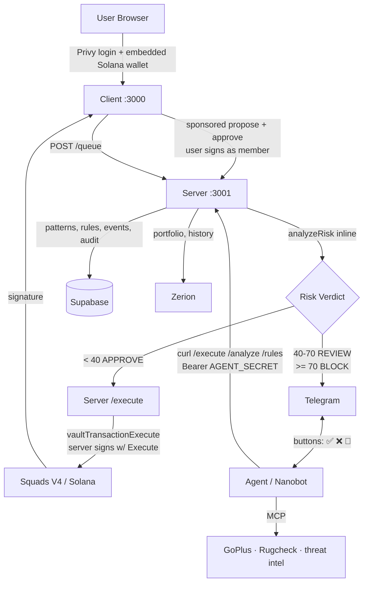
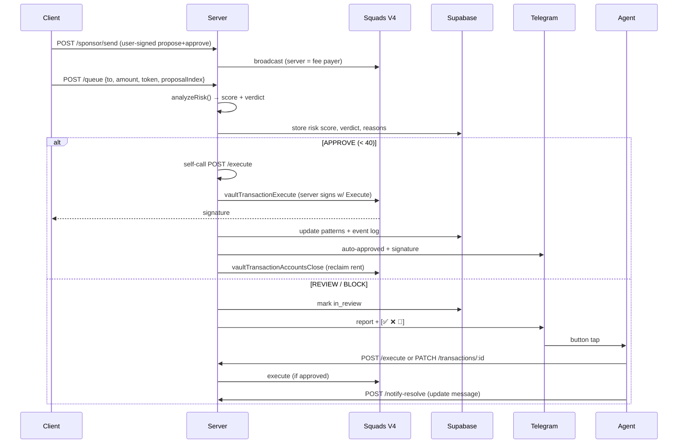

## Components

| Component | Role |
|-----------|------|
| `client/` | Next.js 15 dapp — Privy auth, vault portfolio, send/receive, queue, settings |
| `backend/` | Express API — sponsor, queue, risk engine, execute, analyze, rules, Telegram glue |
| `agents/` | Nanobot skill pack — conversational layer over the Sage API, MCP security tools |
| `src/` | Squads V4 SDK wrappers — `createMultisig`, PDA derivation, on-chain state |
| `site/` | Marketing site + brand kit |

## Client

- **Next.js 15** App Router, React 18, TypeScript, Tailwind CSS, Framer Motion
- **Privy** for auth + an embedded Solana wallet
- Deploys a Squads V4 multisig per user (member = user's wallet with `all`; co-signer = server with `Execute`)
- Builds `vaultTransactionCreate + proposalCreate + proposalApprove`, the user signs as a member, then the server sponsors the fee
- Registers the proposal with `POST /queue`
- **Portfolio** via Zerion (live balances, prices, history)

## Server

- **Express** with TypeScript, backed by **Supabase**
- Runs `analyzeRisk()` inline on every `/queue` request — no async roundtrip, no LLM
- Holds the sponsor keypair: fee payer, rent collector, and the `Execute` member on every vault
- Self-calls `/execute` on APPROVE; brokers Telegram on REVIEW / BLOCK
- Calls GoPlus, Rugcheck, and Zerion for deep analysis and portfolio data

## Agent

- **Nanobot skill pack** — conversational layer, authenticated with `AGENT_SECRET`
- Routes Telegram messages and button taps to the Sage API
- Has access to **security tools over MCP** (GoPlus, Rugcheck, sanctioned-address lookups) for ad-hoc analysis
- Owns no deterministic logic — it calls endpoints and reports the actual result

## Data Flow

## Persistence

All state lives in **Supabase** (Postgres). Key tables:

| Concern | Stored |
|---------|--------|
| Proposals | Risk score, verdict, reasons, status, signature, in-review/rejected flags |
| Patterns | Recipient profiles, time patterns, token familiarity, velocity counters, global limits |
| Rules | Per-vault custom policy rules |
| Events | Append-only behavioral event log (auto-approved, sent-for-review, blocked, executed, rejected) |
| Threat intel | Curated known-malicious address records |
| Users | Vault ↔ signer ↔ Telegram chat mapping |

## Tech Stack

| Layer | Technology |
|-------|-----------|
| Chain | Solana |
| Multisig | Squads Protocol V4 (`@sqds/multisig`) |
| Frontend | Next.js 15, React 18, TypeScript, Tailwind CSS, Framer Motion |
| Auth + wallet | Privy (embedded Solana wallets + JWT verification) |
| Backend | Express, TypeScript, Supabase, PM2 (production) |
| Security feeds | GoPlus, Rugcheck, Sage threat intel |
| Portfolio | Zerion |
| AI Agent | Nanobot skill pack + MCP security tools, over Telegram |
